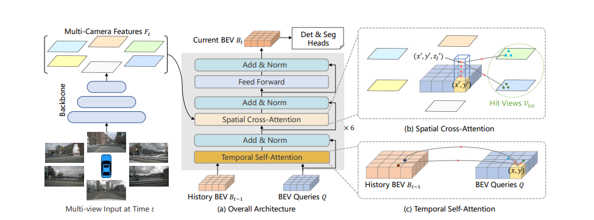
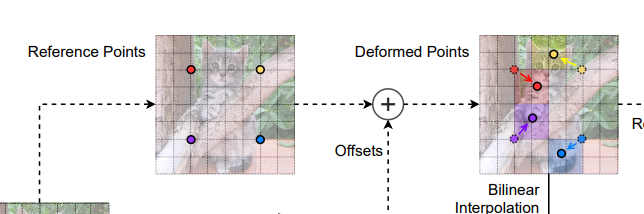
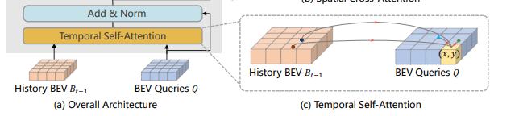
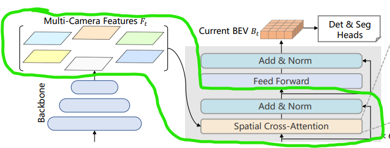

# BEVFormer

The paper proposes to learn the BEV (Bird's Eye View) features directly from the surround camera images.

## Pipeline Overview

1. The visual features of the images are extracted using a CNN backbone.
2. At the decoder:  
   * **Learnable BEV queries** represent a grid of spatial locations in the BEV space.  
   * **Temporal attention** fuses the previously predicted BEV features into the current frame.
   * **Spatial attention** fuses the current image features into temporal features.
3. The output is a BEV feature map. This feature map is then passed through a task-specific head to get the desired output like 3D bounding box detection.

## Criticisms of the Paper

1. The learned BEV features are not interpretable (like an occupancy map or a segmentation map), but rather remain in the feature space.
2. A task-specific head and corresponding loss are required to get the desired outputs like 3D bounding box detection. 
3. The spatial attention samples 4 height values to generate the 3D-to-2D projection. If an object's height is taller than or below the sampled heights, this case is not explicitly handled by geometry and relies entirely on backpropagation.
4. BEV features require consecutive image frames, whereas the Ground Truth (GT) for tasks like 3D bounding box detection is available at a lower frequency. This means BEV features are updated only when the GT is available, limiting full utilization of temporal information.

## Deformable Attention

The original attention mechanism computes the similarity between all pixels, making it computationally expensive with $\mathcal{O}(N^2)$ complexity:

$$
\text{Attention}(Q, K, V) = \text{softmax}\left(\frac{QK^T}{\sqrt{d_k}}\right)V \tag{1}
$$

The deformable attention mechanism computes the similarity between a set of localized features around the query features. This reduces the complexity to $\mathcal{O}(N)$:

$$\text{DeformAttn}(Q, p, x) = \sum_{k=1}^{K} Linear(Q_k) \cdot x(p + \Delta p_{qk}) \tag{2}$$

where:  
* $p$ is the current pixel position  
* $\Delta p_{qk}$ is the predicted offset from the current pixel position  
* $Q_k$ is the $k$-th query  

For each pixel in the BEV query, 4 offsets $\Delta p_{qk}$ are predicted. These offsets are added to the current pixel position to get the sampled pixel positions. It is used as a mask to extract the features from the value vector $x$. Finally, the weighted sum of the features is computed for all 4 offsets.

## Temporal Attention

There are 2 components for temporal attention:
1. Learnable BEV query $Q_t$
2. The previously predicted BEV feature $B_{t-1}$ is motion-compensated to the current timestep $B'_{t-1}$.  

Equation (2) is used to calculate the attention. For a given pixel in the BEV query $Q_t$, two types of attention are performed:

1. **Sampling from present BEV queries**  
   In this step, $x$ is the BEV query $Q_t$. 4 offsets $\Delta p_{qk}$ are predicted for each query pixel. The value from $x$ at $p + \Delta p_{qk}$ is extracted. All 4 features are aggregated to form a single feature vector.
   
2. **Sampling from past BEV features**  
   In this step, $x$ is the previous motion-compensated BEV feature $B'_{t-1}$. 4 offsets $\Delta p_{qk}$ are predicted for each query pixel. The value from $x$ at $p + \Delta p_{qk}$ is extracted. All 4 features are aggregated to form a single feature vector.

The resulting feature vectors from both attention steps are summed together to produce the final temporal attention output.

## Spatial Attention

At each grid cell on the BEV features output by the temporal attention layer, 4 height values are sampled to lift the 2D cell into a 3D pillar. These 3D points are then projected onto the 2D camera image planes using calibration matrices, pinpointing the corresponding spatial region. Because geometry gives us this direct focal point, an exhaustive Key vector search across the entire image is not required, and we can directly use deformable attention to sample locally.

where:
* $p$ is the 3D point projected to the 2D image feature space.
* $x$ is the image feature vector.
* $Q$ is the query from the temporal attention layer.
* $\Delta p_{qk}$ is the predicted offset for the $k$-th sampling point (predicted for each sampled height).
